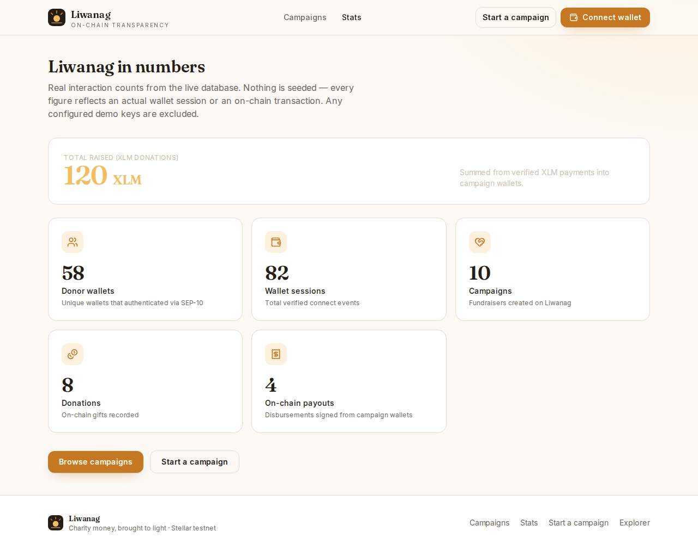
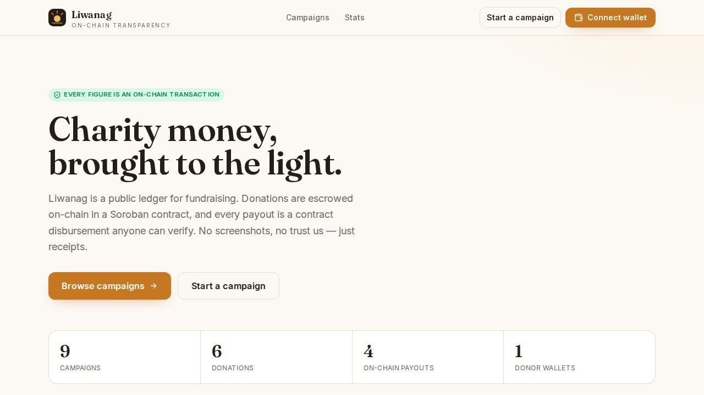
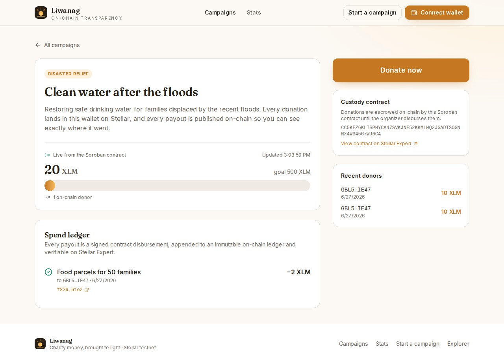
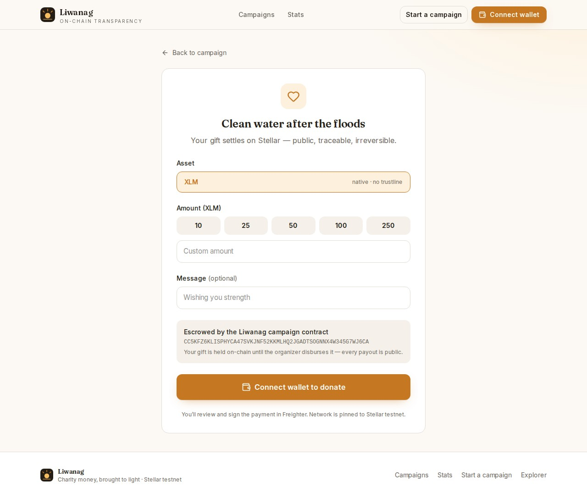
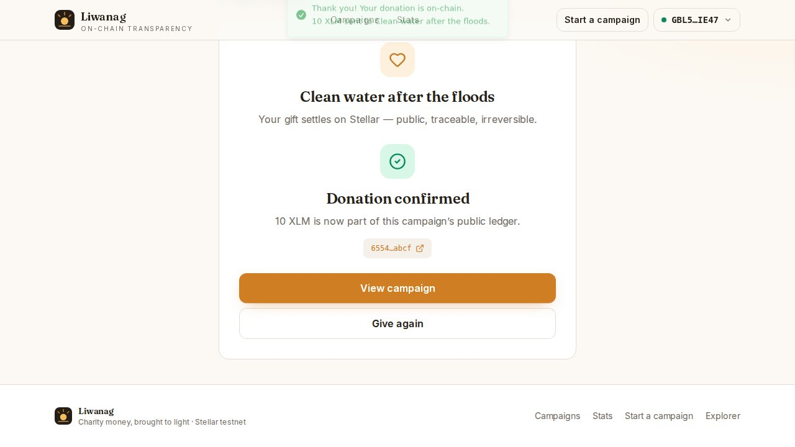
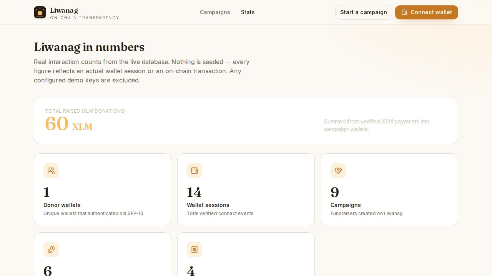
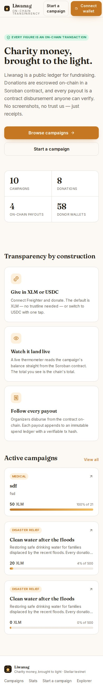

# Liwanag

**Charity money, brought to the light.**

Liwanag (Filipino for *light / clarity*) is a public, on-chain transparency board for charity
campaigns on Stellar. Every donation is escrowed in a **Soroban smart contract**, the live
thermometer reads the campaign's balance straight from the chain, and every disbursement is
appended to an **immutable on-chain spend ledger**. No screenshots, no "trust us" — just receipts.

**Live:** https://liwanag-rho.vercel.app
**Network:** Stellar **testnet**
**Contract:** [`CC5KFZ6K…WJ6CA`](https://stellar.expert/explorer/testnet/contract/CC5KFZ6KLISPHYCA47SVKJNF52KKMLHQ2JGADTSOGNNX4W345G7WJ6CA)

---

## Why it exists

Most fundraising platforms ask you to trust a dashboard. You can't see where the money sits, you
can't see where it went, and "100% to the cause" is a claim, not a proof.

Liwanag flips that. Donations don't land in someone's personal wallet — they're **held by a
contract** that anyone can read. The number on the thermometer **is** the contract's balance. The
spend ledger **is** the contract's list of disbursements. Anyone — donor, journalist, auditor — can
click through to Stellar Expert and check the math themselves.

## How it works

1. **Open a campaign.** Connect Freighter and create a campaign with a goal. You sign one
   transaction that registers the campaign on-chain (`open_campaign`); your wallet is the organizer.
2. **Donate in XLM.** Donors connect and sign a `donate` contract invoke. The asset is fixed at
   creation — XLM is the default (native, no trustline); USDC campaigns are supported with the
   one-tap **Enable USDC** trustline helper.
3. **Watch it land live.** The campaign page polls the contract's `get_campaign` view, so the raised
   total and donor count are read straight off the chain.
4. **Follow every payout.** The organizer disburses from the contract on-chain (`disburse`). Each
   payout transfers to the recipient **and** appends a `SpendRecord` (recipient, amount, memo hash,
   ledger) to the public spend ledger that can never be edited.

---
## Demo & Pitch Deck

- **Demo Video:** [Watch Demo](https://drive.google.com/file/d/1TtIh2FBZH-pbVvP8T3QPxp3BFzXABWO0/view?usp=drive_link)
- **Pitch Deck:** [View Pitch Deck](https://drive.google.com/file/d/1mdc57SoMKcnex5FeaZWcVhLpSAv7yiCp/view?usp=drive_link)
---

## The smart contract

The core is a Soroban contract, `charity-campaign` (`contracts/`), deployed to testnet:

| | |
| --- | --- |
| Contract ID | `CC5KFZ6KLISPHYCA47SVKJNF52KKMLHQ2JGADTSOGNNX4W345G7WJ6CA` |
| Admin / deployer | `GBL5RJKF4QNJ4ZPLJZ7PS7K5A4J44VEZJRV2CRTFFDRVSY2N76AIIE47` |
| Token (XLM SAC) | `CDLZFC3SYJYDZT7K67VZ75HPJVIEUVNIXF47ZG2FB2RMQQVU2HHGCYSC` |

- `open_campaign(organizer, campaign_id, token, goal)` — organizer-signed; registers the campaign.
- `donate(donor, campaign_id, amount) -> raised` — donor-signed; escrows funds, tracks per-donor + total.
- `disburse(organizer, campaign_id, recipient, amount, memo) -> index` — organizer-signed; pays out and appends the on-chain ledger.
- Views: `get_campaign`, `raised`, `balance`, `donor_amount`, `spend_count`, `get_spends`, `total_raised`.

It ships with **15 passing unit tests** (`cd contracts && make test`). Build/deploy details and tx
hashes are in [`contracts/DEPLOYMENT.md`](./contracts/DEPLOYMENT.md).

## What makes it real

- **On-chain custody.** Donations are escrowed by the contract via the XLM Stellar Asset Contract —
  not a hot wallet. Only the campaign organizer can disburse, never more than the held balance.
- **SEP-10 wallet auth.** Connecting performs a real challenge → sign → verify handshake. The signing
  network passphrase is **pinned to the app's testnet**, so connecting works even if your wallet's
  active network is Mainnet.
- **Server-built, Freighter-signed, RPC-submitted.** Every `open`/`donate`/`disburse` is a contract
  invoke the server builds + simulates, the browser signs in Freighter, and the server submits via
  the Soroban RPC.
- **XLM-first, USDC opt-in.** Native XLM works for any funded wallet with zero setup. USDC campaigns
  are supported with the in-app trustline helper so no one gets stuck at `op_no_trust`.
- **Honest stats.** [`/stats`](https://liwanag-rho.vercel.app/stats) counts real wallet sessions and
  real entities (campaigns, donations, payouts) from the live database.

## Live stats



Real interaction counts from the live database. Nothing is seeded — every figure reflects an actual wallet session or an on-chain transaction. Any configured demo keys are excluded.

| metric | value |
|---|---|
| Total raised (XLM donations) | 120 XLM |
| Donor wallets | 58 |
| Wallet sessions | 82 |
| Campaigns | 10 |
| Donations | 8 |
| On-chain payouts | 4 |

## Screenshots

All captured from the live deployment during the end-to-end test run.

| Landing | Campaign + on-chain ledger |
| --- | --- |
|  |  |

| Donate | Donation confirmed |
| --- | --- |
|  |  |

| Stats | Mobile |
| --- | --- |
|  |  |

Also in [`screen-shot/`](./screen-shot): `02-connect.jpg`, `03-create-campaign.jpg`.

## Real transactions from the live demo

- Donation — `donate` invoke (10 XLM): [`6554b8a1…6e92abcf`](https://stellar.expert/explorer/testnet/tx/6554b8a117b6fc51799cdab369d427c68466302cd9ad630240b9f4426e92abcf)
- Payout — `disburse` invoke (2 XLM): [`f839a4ef…e7c061e2`](https://stellar.expert/explorer/testnet/tx/f839a4efdc457ddfef97a2e8aca2aa97fd6dc161aac1eeae90be9962e7c061e2)
- Contract: [`CC5KFZ6K…WJ6CA`](https://stellar.expert/explorer/testnet/contract/CC5KFZ6KLISPHYCA47SVKJNF52KKMLHQ2JGADTSOGNNX4W345G7WJ6CA)

## Tech stack

- **Next.js 16** (App Router, React 19, Turbopack) on **Vercel**
- **Soroban** smart contract (`soroban-sdk` 22, Rust 1.89) — donations escrow + spend ledger
- **Stellar SDK** (`@stellar/stellar-sdk`) + **Freighter API v6** (`@stellar/freighter-api`)
- **Drizzle ORM** on **Postgres** (Supabase)
- **Tailwind CSS v4** with a custom "warm paper + ink + amber" design system, Fraunces + Inter type
- **Vitest** (unit) and **Playwright** (live-URL end-to-end)

## Stellar integration

| Feature | Where |
| --- | --- |
| CharityCampaign Soroban contract | `contracts/charity-campaign/` |
| Build / submit / read contract invokes | `src/server/stellar/soroban.ts` |
| SEP-10 challenge / verify | `src/server/stellar/sep10.ts`, `app/api/auth/*` |
| `changeTrust` (Enable USDC) | `app/api/trustline/*`, `src/ui/components/enable-usdc-button.tsx` |
| Network-pinned signing | `src/ui/wallet/freighter.ts` |
| Live on-chain board (reads `get_campaign`) | `src/ui/components/campaign-live-board.tsx`, `app/api/campaigns/[id]/onchain` |

## Routes

| Path | Purpose |
| --- | --- |
| `/` | Landing with live stat strip |
| `/campaigns` | Browse all campaigns (open, no wallet needed) |
| `/campaigns/[id]` | Live on-chain board, donors, spend ledger, owner payout tools |
| `/donate/[id]` | Donate through the contract (XLM default, USDC opt-in) |
| `/admin` | Create + open a campaign on-chain (connect required) |
| `/stats` | Real interaction counts |
| `/api/auth/*` | SEP-10 challenge / verify / me / logout |
| `/api/campaigns`, `/api/campaigns/[id]/open`, `/api/campaigns/[id]/onchain` | Create + on-chain open + live read |
| `/api/donations/*`, `/api/spend/*`, `/api/trustline/*`, `/api/stats`, `/api/health` | JSON API |

## Quick start

```bash
pnpm install

# Configure environment (see .env.example for every key)
cp .env.example .env.local
#   DRIZZLE_DATABASE_URL  – Postgres connection string
#   SESSION_SECRET        – 32+ random chars
#   STELLAR_SIGNING_SECRET– a testnet secret key for the SEP-10 server account
#   CHARITY_CONTRACT_ID   – the deployed Soroban contract (default works on testnet)

pnpm db:push      # create tables: campaigns, donations, spend_items, sessions
pnpm dev          # http://localhost:3001
```

### The contract

```bash
cd contracts
make test          # cargo +1.89.0 test — 15 unit tests
make optimize      # build + stellar contract optimize
./scripts/deploy.sh
```

### Testing

```bash
pnpm build        # production build + typecheck
pnpm test         # vitest: money + SEP-10 unit tests

# End-to-end against a live URL (real Freighter extension, headed under xvfb):
PLAYWRIGHT_BASE_URL="https://liwanag-rho.vercel.app" \
  xvfb-run -a pnpm exec playwright test --project=desktop-chrome tests/e2e/prod-real.spec.ts
```

## Environment variables

| Var | Notes |
| --- | --- |
| `DRIZZLE_DATABASE_URL` / `DATABASE_URL` | Postgres |
| `SESSION_SECRET` | HMAC key for session cookies (32+ chars) |
| `STELLAR_SIGNING_SECRET` | Testnet secret key for the SEP-10 challenge server account |
| `STELLAR_NETWORK` / `NEXT_PUBLIC_STELLAR_NETWORK` | `testnet` |
| `STELLAR_HORIZON_URL` | `https://horizon-testnet.stellar.org` |
| `STELLAR_NETWORK_PASSPHRASE` | `Test SDF Network ; September 2015` |
| `SOROBAN_RPC_URL` | `https://soroban-testnet.stellar.org` |
| `CHARITY_CONTRACT_ID` / `NEXT_PUBLIC_CHARITY_CONTRACT_ID` | Deployed CharityCampaign contract id |
| `XLM_SAC_CONTRACT_ID` | Native XLM Stellar Asset Contract (default campaign token) |
| `NEXT_PUBLIC_USDC_ISSUER` | Testnet USDC issuer |
| `NEXT_PUBLIC_APP_URL` | Deployed alias |
| `DEMO_ADDRESSES` | Optional comma-separated wallets to exclude from stats |

---

Built for the Stellar APAC hackathon. Testnet only.
